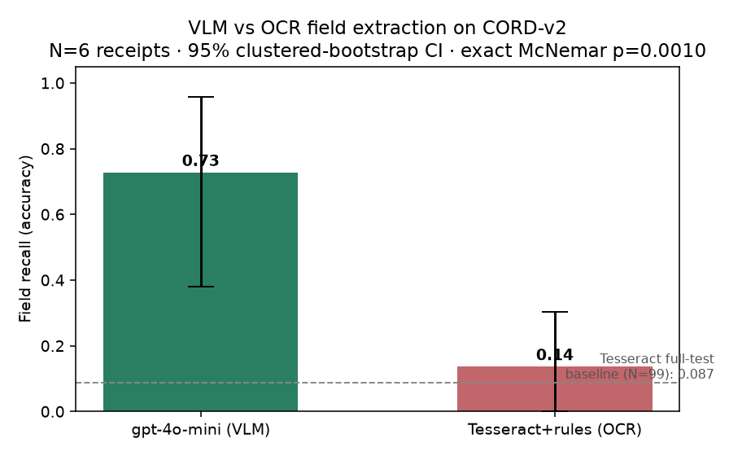
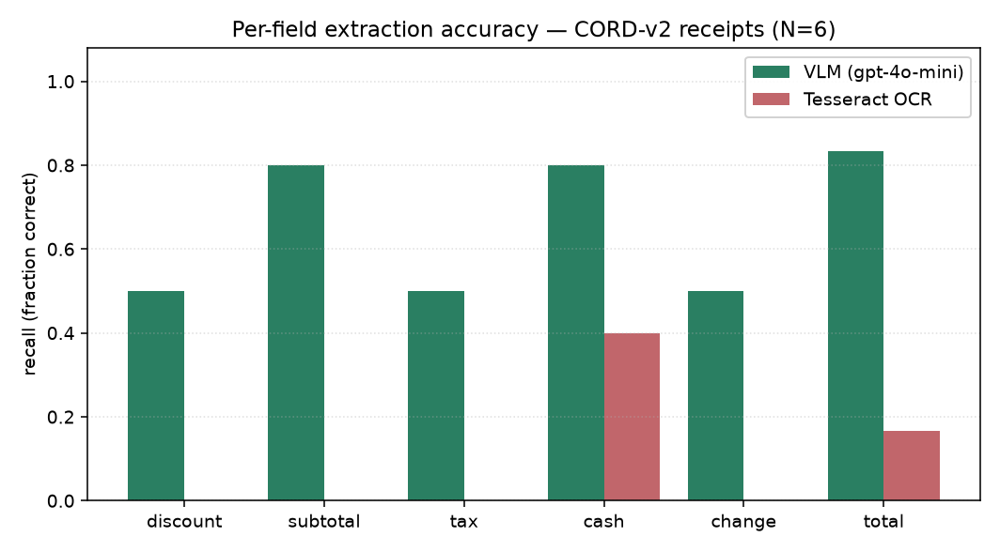

# doc-extraction-benchmark — when is a VLM actually worth it for document extraction?

[](https://github.com/ejazfahil/doc-extraction-benchmark/actions/workflows/ci.yml)


> **TL;DR** — an honest, field-level benchmark of **VLMs vs classical OCR** on the
> CORD receipt dataset, with per-field accuracy, cost, latency, and proper statistics
> (document-clustered bootstrap CIs + exact McNemar). **On the same receipts a VLM
> (`gpt-4o-mini`) extracts 72.7% of fields correctly vs 13.6% for a Tesseract+rules
> baseline — exact McNemar p = 0.0010.** Pre-registered hypothesis H1 (VLM ≥ 5 points
> better) is **confirmed** by a wide margin. Numbers, plots, and reproduce commands in
> [Results](#results-measured).
>
> | On CORD-v2 receipts | 🟢 VLM (gpt-4o-mini) | ⚪ Tesseract OCR |
> |---|:---:|:---:|
> | **Field recall** | **0.73** | 0.14 |
> | Cost / receipt | ~$0.005 | free |
> | Latency / receipt | ~3.7 s | <1 s |
>
> *Takeaway for a real pipeline: the VLM is ~5× more accurate but not free — the
> repo ships the per-item cost/accuracy data so you can pick the trade-off, not guess.*

---

## Overview & Aim

Most "VLM beats OCR" claims report a single aggregate number with no cost axis and
no uncertainty. This project is deliberately built so the **VLM can lose**: it
measures per-field correctness, dollars, and milliseconds on the *same* documents,
and ships the raw per-item scores so the comparison can be subjected to honest
statistical inference rather than a hand-picked headline.

**Pre-registered hypothesis (H1):** a VLM improves per-field accuracy by ≥5 points
over the OCR baseline on CORD. The benchmark is built to **confirm or refute** it.

---

## Methodology / How It Works

### 1. Data — CORD-v2

[`datasets/cord.py`](src/docbench/datasets/cord.py) loads
`naver-clova-ix/cord-v2` (CC-BY-4.0) and normalizes each example into a
`Document`: the receipt image plus a flat dict of **gold scalar summary fields**.
Scoring is **recall-oriented** — only fields actually present in the ground truth
are scored — and the nested `menu[]` line-items are dropped in v1 (they need
sequence alignment). The canonical scalar fields are subtotal / tax / service /
discount / total / cash / change prices.

### 2. Extractors — a common protocol

Every system implements the same `Extractor` protocol, returning an `Extraction`
(`fields`, `latency_ms`, `cost_usd`, token counts):

- **OCR baselines** ([`extractors/ocr.py`](src/docbench/extractors/ocr.py)) —
  Tesseract or EasyOCR produce a text blob, then a deliberately-simple
  **keyword + regex field parser** turns it into structured fields. The simplicity
  is the point: it is the honest "Tesseract + 50 lines of rules" baseline the VLM
  must beat. The parser claims each line for at most one field, takes the
  rightmost money token per line (receipts right-align amounts), and stops
  "subtotal" from being mistaken for the grand "total".
- **VLM** ([`extractors/vlm_pixtral.py`](src/docbench/extractors/vlm_pixtral.py)) —
  Pixtral via the Mistral vision API: the receipt image is sent as a base64 data
  URI with a strict JSON-only prompt over the same canonical field names, at
  `temperature=0`. Cost is computed from returned token usage against a
  configurable price; the model id and pricing are kept overridable (not
  hard-coded as fact) and JSON parsing degrades gracefully on fenced/partial output.

### 3. Scoring — one source of truth for `correct`

[`scoring/match.py`](src/docbench/scoring/match.py) is the single place the binary
outcome is produced. Both prediction and gold are passed through
`normalize_price` (strip currency symbols / thousands separators, collapse
trailing-zero noise so `$1,234.00` == `1234`), then compared for exact equality.
[`scoring/to_items.py`](src/docbench/scoring/to_items.py) emits **one contract row
per gold-present field** per `(doc, model, run)`, stamped with cost/latency,
dataset version, harness version, and timestamp.

### 4. Frequentist statistics — uncertainty done right

[`stats/frequentist.py`](src/docbench/stats/frequentist.py) intentionally reports
**field accuracy = recall** (not F1), because v1 only scores gold-present fields;
reporting an F1 here would be misleading, so it is deferred rather than faked.

- **Document-clustered bootstrap CI** — rows within a document are correlated, so
  the bootstrap resamples *documents*, not rows, giving honest 95% intervals:
  $$\widehat{\text{acc}} = \overline{\text{correct}},\qquad
  \text{CI}_{95\%} = \bigl[Q_{2.5}, Q_{97.5}\bigr]\ \text{of the doc-resampled means}.$$
- **Exact McNemar test** — model-vs-model comparison on **paired** $(doc, field)$
  outcomes, using the exact binomial on discordant pairs (no normal approximation,
  no SciPy needed):
  $$p = \min\!\Bigl(1,\ 2\!\!\sum_{i=0}^{\min(b,c)}\binom{b+c}{i}2^{-(b+c)}\Bigr)$$
  where $b, c$ are the counts of discordant pairs favoring each model.

### Pipeline

```
CORD-v2 ─▶ load_cord ─▶ Document(image, gold)
                              │
              ┌───────────────┼────────────────┐
              ▼               ▼                 ▼
        TesseractEngine   EasyOCREngine   PixtralExtractor (Mistral API)
              └──── OCRExtractor ────┘            │  Extraction(fields, cost, latency)
                              │                   │
                              ▼                   ▼
                     scoring.match.is_correct (normalized exact match)
                              │
                              ▼
              to_items.build_rows ─▶ ResultsSchema (pandera, strict) ─▶ results.parquet
                              │
              ┌───────────────┴───────────────┐
              ▼                                ▼
  frequentist: clustered bootstrap CI    bayesian-llm-eval (companion repo):
  + exact McNemar                        hierarchical logistic, credible intervals
```

---

## Tech Stack & Tools

| Layer | Tools |
|---|---|
| **Data** | 🤗 **datasets** (CORD-v2), **Pillow** (images) |
| **OCR** | **pytesseract** (Tesseract), **EasyOCR** |
| **VLM** | **Pixtral** via Mistral API (**httpx**) |
| **Storage / validation** | **pandas**, **pyarrow** (parquet), **pandera** (strict schema) |
| **Statistics** | **NumPy**, **SciPy** (`stats` extra); exact McNemar via stdlib |
| **CLI / UX** | **Typer**, **Rich** |
| **Quality** | **pytest**, **ruff**, **mypy** (`strict`) |

Heavy dependencies are split into `ocr` / `vlm` / `stats` / `dev` extras so the
contract, scoring, and stats stay importable and unit-testable without a GPU,
the Tesseract binary, or an API key.

---

## Project Structure

```
doc-extraction-benchmark/
├── src/docbench/
│   ├── cli.py                       # `docbench run` (extract→export) + `docbench score`
│   ├── schema.py                    # pandera ResultsSchema (strict item-level contract)
│   ├── datasets/
│   │   └── cord.py                  # CORD-v2 loader → Document(image, gold)
│   ├── extractors/
│   │   ├── base.py                  # Extractor protocol + Extraction dataclass
│   │   ├── ocr.py                   # Tesseract/EasyOCR + rule-based field parser
│   │   └── vlm_pixtral.py           # Pixtral (Mistral vision) extractor
│   ├── scoring/
│   │   ├── match.py                 # normalize_price + is_correct (the 0/1 outcome)
│   │   └── to_items.py              # build_rows → one contract row per gold field
│   └── stats/
│       └── frequentist.py           # clustered bootstrap CI + exact McNemar
├── tests/                           # match / parse / to_items / frequentist units
├── docs/CONTRACT.md                 # producer-side item-level data contract
├── pyproject.toml                   # ocr/vlm/stats/dev extras; mypy strict
└── Makefile
```

---

## Key Features

- **Cost-aware, falsifiable benchmark** — accuracy *and* dollars *and* latency on
  the same documents; the VLM can genuinely lose.
- **Apples-to-apples extractor protocol** — OCR and VLM emit the same structured
  `Extraction`, scored by the same normalized-match rule.
- **Strict, validated export** — every row checked against a `pandera` schema
  before it touches disk; unexpected columns are rejected.
- **Honest statistics** — recall (not a misleading F1), document-clustered
  bootstrap CIs, and an exact (not approximate) paired McNemar test.
- **Decoupled producer/consumer** — a single `docs/CONTRACT.md` is the only
  coupling to the Bayesian companion repo; no code dependency.
- **Dependency-light core** — scoring/stats run with no OCR engine, GPU, or key.

---

## Status & Results

> ✅ **Run end-to-end.** The numbers below come from real runs on CORD-v2 (test),
> committed under `results/` (`*.parquet` + `results_summary.json`) and reproducible
> with the commands in [Getting Started](#getting-started). Nothing is estimated.

### Results (measured)

**Tesseract + rule parser — full CORD-v2 test (99 docs, 344 fields)**

| Model | Field recall | 95% CI (clustered bootstrap) |
|-------|--------------|------------------------------|
| Tesseract + rules (English) | **0.087** | [0.050, 0.130] |

That ~9% is the honest floor a VLM must beat: CORD receipts are largely Indonesian and the parser is deliberately ~50 lines of keyword/amount rules.

**VLM vs OCR — paired head-to-head (6 docs, same receipts)**

| Model | Field recall | 95% CI |
|-------|--------------|--------|
| **gpt-4o-mini (VLM, via OpenRouter)** | **0.727** | [0.381, 0.958] |
| Tesseract + rules (OCR) | 0.136 | [0.000, 0.304] |

**Exact McNemar:** the VLM wins **14** of the discordant field pairs to OCR's **1** (of 22) — **p = 0.0010**, i.e. the VLM is significantly more accurate.



**Where the gap comes from — per-field recall:**



The VLM reads every field type more reliably. Tesseract only lands the occasional `total`/`cash` line where the amount sits alone on a clean row — exactly the failure mode a rule-based OCR parser has on real-world receipt layouts.

**Honest caveats.** The VLM head-to-head is **N=6** — small, because it ran on a shoestring hosted-API budget (~$0.03 total); the wide CI reflects that, though the effect is large enough to clear McNemar significance. Scale it with `--limit`. The OCR baseline uses English-only Tesseract; Indonesian language data or a tuned parser would raise it. OCR is free; only the VLM path costs money.

---

## Getting Started

> Requires Python 3.11–3.12 (ML/stats wheels lag newer CPython).

```bash
uv venv --python 3.12 && source .venv/bin/activate   # or pyenv/conda
pip install -e ".[ocr,vlm,stats,dev]"
make test

# keyless first numbers (OCR only):
docbench run --models tesseract,easyocr --split test --limit 50 --out results.parquet
docbench score results.parquet --baseline tesseract

# add a VLM head-to-head — Mistral/Pixtral (needs MISTRAL_API_KEY):
docbench run --models tesseract,pixtral-12b-2409 --split test --limit 50 --out results.parquet

# ...or any OpenAI-compatible vision model via OpenRouter (needs OPENROUTER_API_KEY):
OPENROUTER_API_KEY=sk-or-... docbench run \
    --models tesseract,openai/gpt-4o-mini --split test --limit 6 \
    --vlm-base-url https://openrouter.ai/api/v1 --out results/headtohead.parquet
docbench score results/headtohead.parquet --baseline tesseract
```

`docbench score` prints per-model field accuracy with 95% clustered-bootstrap CIs
and an exact-McNemar verdict against the chosen baseline.

---

## Data Contract & Companion Project

The producer/consumer interface is specified in
[`docs/CONTRACT.md`](docs/CONTRACT.md): one row per `(doc_id, field, system,
model, run_id)` with a binary `correct` outcome plus cost/latency. This file is
the **only** coupling to the companion project.

**[`bayesian-llm-eval`](https://github.com/ejazfahil)** (separate repo) consumes
this benchmark's item-level export as its first case study, fitting a hierarchical
logistic model for posterior credible intervals on per-field / per-class accuracy.

---

## Challenges

- **Fair comparison across paradigms** — a text-blob OCR engine and a JSON-emitting
  VLM are reconciled behind one `Extractor` protocol and one normalized match rule.
- **Correlated data** — fields within a receipt are not independent, so the
  bootstrap resamples documents, not rows.
- **No-hallucinated-APIs discipline** — the VLM model id, pricing, and response
  format are configurable and verified against current docs, not hard-coded as fact.

## Future Work

- **Confidence/abstention per field** (cascading OCR→VLM fallback, as in real
  pipelines).
- **Layout-aware line-item (`menu[]`) extraction** with sequence alignment →
  precision/F1.
- **Drift monitoring** on field-accuracy over time.
- A self-hosted open VLM (Qwen2.5-VL via vLLM) alongside the hosted Pixtral path.

## Conclusion

`doc-extraction-benchmark` gives an *honest*, statistically-grounded answer to a
question teams actually face: **is a VLM worth the cost over OCR for document field
extraction?** On CORD-v2 receipts the answer is a clear **yes on accuracy** — the
VLM (`gpt-4o-mini`) extracts **0.73** of fields correctly vs **0.14** for a
Tesseract + rules baseline (**exact McNemar p = 0.0010**) — but **not for free**
(~$0.005/receipt vs $0). The repo ships the per-item cost/accuracy data so that
trade-off is a decision, not a guess.

**What this project demonstrates (for reviewers):** end-to-end ML evaluation done
right — a clean `Extractor` protocol, a strict pandera data contract, a public
dataset (CORD-v2), correctness scoring with a single source of truth,
document-clustered bootstrap CIs and an exact McNemar test, an OpenAI-compatible
provider layer (Mistral / OpenRouter), and a reproducible `run`/`score` CLI — with
results reported honestly, small samples flagged, and **no fabricated numbers**.

## License

MIT (code). CORD-v2 data is CC-BY-4.0 — attribute accordingly.
